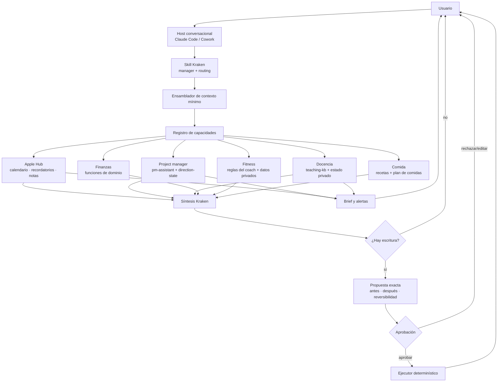

# Borrador avanzado — Kraken como cerebro orquestador

> Estado: borrador para discusión  
> Fecha: 2026-07-27  
> No reemplaza [PLAN.md](PLAN.md): la semana de validación del brief sigue siendo
> la puerta de entrada. Este documento describe lo que viene después.

## 1. Resultado buscado

Kraken debe ser la única puerta de entrada para consultar y operar la vida diaria
del usuario. Debe poder:

1. explicar el día y anticipar problemas;
2. consultar conocimiento y estado de varios dominios;
3. combinar agenda, proyectos, clases, entrenamiento, comida y finanzas;
4. proponer quick actions;
5. ejecutar cambios solo bajo una política explícita de aprobación;
6. recordar decisiones y correcciones útiles sin guardar conversaciones enteras;
7. funcionar por defecto sin consumir APIs pagas de modelos.

El primer objetivo no es “tener muchos agentes”. Es resolver bien dos áreas:

- **vida personal / Apple Hub**;
- **dirección y planificación de proyectos**.

Los demás dominios se conectan después mediante el mismo contrato.

## 2. Decisiones de arquitectura propuestas

### 2.1 Patrón elegido

Kraken será una combinación de tres patrones:

| Patrón | Uso en Kraken | Cuándo corre |
|---|---|---|
| Pipeline determinístico | Brief, lectura de fuentes, cálculos, validación y entrega | Siempre que el flujo sea conocido |
| Router | Elegir el mínimo conjunto de especialistas y herramientas | En cada consulta conversacional |
| Manager/orchestrator | Conservar la conversación, reunir resultados, mostrar conflictos y producir la respuesta final | Cuando participa uno o más dominios |
| Orchestrator-workers | Consultar en paralelo dominios independientes y sintetizar | Solo en preguntas realmente transversales |
| Loop planner–critic | Crear y revisar un boceto complejo con límite de iteraciones | Solo para capacidades que lo justifiquen |
| A2A | Transporte entre agentes independientes | No en el MVP; posible adaptador futuro |

No se usará un router puro porque hay consultas que cruzan dominios. Tampoco se
consultará siempre a todos los especialistas: eso aumentaría costo, ruido y riesgo
de mezclar datos sin necesidad.

Referencias estudiadas:

- [Router del ejemplo de BettaTech](https://github.com/betta-tech/agentic-patterns-typescript/blob/main/src/pattern_2_router.ts)
- [Orchestrator-workers del ejemplo](https://github.com/betta-tech/agentic-patterns-typescript/blob/main/src/pattern_4_orchestrator_workers.ts)
- [Orquestación de agentes de OpenAI](https://openai.github.io/openai-agents-python/multi_agent/)
- [Especificación oficial A2A](https://github.com/a2aproject/A2A/blob/main/docs/specification.md)

### 2.2 Kraken conserva el control

Los especialistas no toman la conversación ni notifican directamente.

- Kraken entiende el pedido.
- Kraken decide qué fuentes y especialistas necesita.
- Cada especialista devuelve hechos, advertencias, opciones o propuestas
  estructuradas.
- Kraken muestra quién aportó o advirtió cada cosa.
- Kraken pregunta cuando falta información.
- Solo Kraken entrega la respuesta o alerta.

Esto conserva la regla actual de [ROUTER.md](ROUTER.md): una sola puerta de
entrada y una sola capa con permiso de interrumpir.

### 2.3 Una experiencia, fronteras internas

El usuario no quiere mantener cuentas o experiencias separadas para cada parte
de su vida. La interfaz será una sola, pero eso no implica mezclar físicamente
todos los datos.

Principio:

> **Una sola conversación no significa un solo almacén ni permisos universales.**

Kraken oculta la complejidad de las fronteras, pero mantiene:

- fuente de verdad por dominio;
- mínimo contexto necesario por consulta;
- prohibición de copiar datos corporativos o sensibles sin necesidad;
- conflictos visibles en lugar de sincronización silenciosa.

### 2.4 Sin API paga por defecto

La ruta inicial será Claude Code/Cowork mediante la skill local de Kraken y las
herramientas del repositorio. El razonamiento conversacional queda cubierto por
la suscripción que el usuario ya paga.

Reglas:

1. Kraken no incorpora una dependencia obligatoria de OpenAI ni Anthropic API.
2. Ninguna variable o flag puede activar gasto por accidente.
3. La ruta paga de `pm-assistant` continúa apagada por defecto.
4. Si en el futuro se habilita una API, debe tener:
   - opt-in explícito;
   - presupuesto mensual;
   - registro de costo por tarea;
   - corte duro al alcanzar el límite.

Una aplicación propia conversacional se difiere. Sin API paga tendría que
automatizar una CLI de suscripción o ejecutar un modelo local; ninguna de las dos
opciones mejora hoy la mantenibilidad. Una app propia sí puede llegar antes como
**panel de propuestas, memoria y estado**, sin ser el runtime del modelo.

### 2.5 Lenguajes

No se reescribirá el código existente solo para unificar el stack.

- **Python:** kernel de Kraken, EventKit, Recordatorios, entrega y adaptador de
  `pm-assistant`.
- **TypeScript:** dominio financiero existente y futura interfaz web.
- **JSON Schema + JSON por stdout/stdin:** contrato portable entre ambos.

La mantenibilidad se consigue con contratos pequeños, no forzando un solo
lenguaje. Reescribir EventKit y `pm-assistant` en TypeScript no produciría valor
de usuario.

## 3. Arquitectura objetivo



### 3.1 Dos runtimes, una arquitectura

Kraken tendrá dos modos que comparten adaptadores:

1. **Runtime programado:** `brief.py`; determinístico, sin modelo.
2. **Runtime conversacional:** la skill interpreta lenguaje natural y llama
   comandos locales con salida estructurada.

La lógica para leer calendario, calcular huecos o detectar una clase sin preparar
no se duplica en prompts.

## 4. Contrato común de capacidades

Cada dominio empieza como documento y funciones. Solo se vuelve agente ejecutable
si necesita razonamiento propio, estado de conversación o despliegue independiente.

Contrato conceptual:

```json
{
  "capability": "calendar.move_event",
  "mode": "read|propose|execute",
  "domain": "personal",
  "input": {},
  "result": {
    "status": "ok|needs_input|conflict|unavailable|error",
    "facts": [],
    "warnings": [],
    "options": [],
    "proposal": null,
    "sources": [],
    "freshness": null
  }
}
```

Reglas del contrato:

- No devolver prosa como única interfaz entre componentes.
- Cada hecho recuperado declara fuente y fecha cuando sea relevante.
- Un conflicto es un resultado válido, no una excepción que se oculta.
- `execute` no acepta texto libre: solo una propuesta validada y aprobada.
- Una fuente caída produce `unavailable`; Kraken no inventa el hueco.

### 4.1 Registro inicial de especialistas

| Especialista | Primera forma | Fuente de verdad | Escritura inicial |
|---|---|---|---|
| Apple Hub | Funciones Python | Calendar, Reminders y Notes | Calendario/Recordatorios con aprobación |
| Project manager | API Python de `pm-assistant` | `direction-state` validado | Estado propio con aprobación |
| Docencia | Documentos + validadores | `teaching-kb`; datos individuales fuera del repo público | Quick actions y propuestas |
| Finanzas | Funciones SQL/TS | PostgreSQL de `finanzas` | Ninguna desde Kraken al inicio |
| Fitness | Documentos del coach + consultas | `fitness-kb/reglas` y almacén privado de datos | Ninguna al inicio |
| Comida | Documentos + funciones Python | Plan de comidas + Cookidoo/recetas | Lista de compras con aprobación |

## 5. Routing

El routing separa cuatro decisiones:

1. **Qué quiere el usuario:** consultar, analizar, planificar, recordar o actuar.
2. **Qué dominios necesita:** uno, varios o ninguno.
3. **Qué riesgo tiene:** lectura, memoria, escritura propia, escritura externa,
   salud o dinero.
4. **Qué información falta:** si falta un dato que cambia la respuesta, se pregunta.

Salida lógica del router:

```json
{
  "intent": "schedule_training",
  "domains": ["personal", "fitness", "projects"],
  "operation": "analyze",
  "write_intent": false,
  "risk": "medium",
  "needs_clarification": false,
  "capabilities": [
    "calendar.free_slots",
    "fitness.session_duration",
    "projects.upcoming_commitments"
  ]
}
```

### 5.1 Reglas de selección

- Una pregunta de un dominio llama a un solo especialista.
- Una consulta transversal llama únicamente a los dominios nombrados o
  necesarios por dependencia.
- Los especialistas no se llaman entre sí en v0.
- Kraken es el único que recibe resultados de varios dominios.
- Las consultas independientes pueden ejecutarse en paralelo.
- Una escritura nunca se ejecuta durante la fase de routing.
- Si el router duda entre capacidades que producen efectos distintos, pregunta.

### 5.2 Ejemplos

**“¿Cuándo entreno sin comprometer la preparación del parcial?”**

1. Apple Hub devuelve huecos reales.
2. Project manager devuelve compromisos y tiempo reservado del parcial.
3. Fitness devuelve duración y opciones de sesión aprobadas por el coach.
4. Kraken cruza restricciones y ofrece alternativas; no mueve eventos.

**“Hoy entreno a las 18 en vez de las 20, ¿qué como?”**

1. Apple Hub confirma horarios.
2. Fitness aporta reglas aprobadas sobre timing y restricciones.
3. Cocina ofrece opciones existentes y disponibilidad.
4. Kraken distingue consejo del coach de sugerencia culinaria.

**“Mové esta reunión al jueves.”**

1. Se identifica un único evento.
2. Se consultan huecos y conflictos del jueves.
3. Se muestra propuesta con evento, fecha anterior, fecha nueva y conflictos.
4. Solo tras aprobación se ejecuta el cambio y se verifica releyendo calendario.

**“Ocurrió este riesgo; ¿cómo lo mitigábamos?”**

1. `pm-assistant` busca el riesgo y la mitigación ya registrada.
2. Si existe, Kraken la cita sin reinventarla.
3. Si no existe, ofrece abrir un análisis, pero aclara que es una propuesta nueva.

## 6. Acciones y aprobación

El mayor fracaso declarado por el usuario es ejecutar algo incorrecto. Por eso el
MVP no tendrá autoejecución externa.

### 6.1 Política inicial

| Acción | Política |
|---|---|
| Lectura y análisis | Sin confirmación |
| Mostrar recomendación u opciones | Sin confirmación |
| Guardar una corrección cuando el usuario dice “recordá…” | La frase exacta cuenta como aprobación |
| Crear o mover evento | Preview + aprobación explícita |
| Crear/quitar recordatorio | Preview + aprobación explícita |
| Cambiar plan o estado de proyecto | Preview + aprobación explícita |
| Registrar o modificar dinero | Fuera del MVP inicial |
| Enviar mensajes a terceros | Kraken solo prepara borrador |
| Cambiar rutina, dieta o prescripción | Fuera de autoejecución |

La autorización para “mover cosas de calendario sin preguntar” se reconsidera
después de observar al menos 20 propuestas correctas. Si se habilita, será por
tipo estrecho y revocable; nunca un modo global de autoaprobar.

### 6.2 Propuesta ejecutable

Toda propuesta muestra:

- acción exacta;
- fuente afectada;
- estado anterior;
- estado posterior;
- conflictos detectados;
- reversibilidad;
- especialista que la propuso;
- vencimiento de la propuesta.

Después de ejecutar:

1. releer la fuente;
2. comparar resultado esperado y observado;
3. informar éxito o discrepancia;
4. nunca encadenar una segunda acción no mostrada.

No se implementará todavía una auditoría exhaustiva de conversaciones o del
razonamiento interno. Sí es obligatorio un historial operacional mínimo de
propuestas y ejecuciones —payload aprobado, fecha, destino y resultado— porque sin
él no se puede diagnosticar ni revertir una acción incorrecta.

## 7. Alertas

Los especialistas detectan; Kraken decide si corresponde alertar y por qué canal.

Alertas v0:

- clase próxima con `preparada: no`;
- compromiso rígido próximo que todavía requiere decisión;
- evento o fuente no disponible que vuelve falso el brief;
- conflicto entre calendario y plan confirmado.

No son alertas v0:

- recomendaciones financieras;
- cambios sugeridos de rutina o alimentación;
- notificaciones emitidas directamente por cada especialista.

Cada alerta debe ser:

- accionable;
- deduplicada;
- silenciable;
- atribuida: “Docencia advierte…” o “Project manager advierte…”.

## 8. Memoria

“Recordar todo” se interpreta como recordar toda decisión reutilizable, no guardar
cada chat. El archivo visible será `MEMORY.md`, con información curada y fácil de
limpiar.

### 8.1 Qué se guarda

- preferencias estables;
- correcciones a errores anteriores;
- decisiones confirmadas;
- restricciones relevantes;
- fuentes de verdad elegidas;
- patrones que ya se repitieron;
- instrucciones del tipo “no vuelvas a hacer X”.

### 8.2 Qué no se guarda

- hechos que ya viven en una fuente consultable;
- respuestas generadas;
- agenda efímera;
- transcripciones completas;
- inferencias no confirmadas;
- copias de datos sensibles de otros dominios.

### 8.3 Formato mínimo

```markdown
## mem-YYYYMMDD-NN — Título breve

- Alcance: transversal | personal | proyectos | docencia | fitness | comida | finanzas
- Tipo: preferencia | corrección | decisión | restricción
- Confirmada: AAAA-MM-DD
- Último uso: AAAA-MM-DD
- Fuente: conversación | archivo | especialista
- Contenido: ...
```

### 8.4 Limpieza

- Kraken propone, no ejecuta, una limpieza cuando el archivo supere un umbral.
- Se marcan duplicados, contradicciones y memorias nunca usadas.
- El usuario elige conservar, fusionar, corregir o borrar.
- Una corrección nueva no borra silenciosamente la anterior: primero muestra el
  conflicto.
- Los datos operativos se eliminan de `MEMORY.md` si ya existe una fuente oficial.

## 9. Fronteras por dominio

### 9.1 Personal / Apple Hub

Responsabilidades:

- agenda y huecos;
- compromisos fijos;
- Recordatorios;
- Notes como fuente de notas, una vez definido el alcance real;
- propuestas de inserción y movimiento;
- brief y alertas.

Antes de implementar escritura de calendario se debe cubrir:

- eventos recurrentes;
- eventos de día completo;
- zonas horarias;
- calendarios de solo lectura;
- asistentes/invitaciones;
- eventos corporativos;
- conflictos y verificación posterior.

Apple Notes no usa EventKit. Primero se hará un inventario de la conexión recién
configurada y se definirá si Kraken la lee mediante conector, AppleScript o una
proyección explícita. No se asumirá que “conectada” significa que `brief.py` ya
puede verla.

### 9.2 Project management

`pm-assistant` ya posee:

- dominio de iniciativas;
- estado validado en `direction-state`;
- detecciones;
- contexto mínimo;
- routing;
- schemas;
- trazas;
- política de propuestas.

`direction-state` es el repo local con las iniciativas reales: un archivo Markdown
por iniciativa, frontmatter validado y cuerpo libre. Kraken lo consulta mediante
la API de `pm-assistant`; no lo parsea por su cuenta.

Prioridades:

1. terminar el desglose e implementación de Spec 002;
2. exponer consultas estructuradas de riesgos, mitigaciones, hitos y unidades;
3. exponer `preparada` al brief;
4. incorporar propuestas de replanificación;
5. recién después evaluar el loop de boceto inicial.

#### Loop de boceto de proyecto

El loop propuesto es:

```text
brief del usuario
  → planner produce borrador tipado
  → validator revisa schema y reglas determinísticas
  → critic busca omisiones, riesgos y contradicciones
  → planner corrige
  → máximo 3 iteraciones
  → Kraken presenta borrador + dudas + desacuerdos
  → usuario aprueba o edita
```

Condiciones:

- salida siempre en estado `borrador`;
- cero escritura externa;
- máximo de iteraciones y tiempo;
- el validator, no otro modelo, decide si el schema es válido;
- si el critic y planner no convergen, se muestran los desacuerdos;
- no se presenta como “plan aprobado”.

**Decisión pendiente importante:** D29 de `pm-assistant` establece hoy que el
sistema no arma la secuencia y que la autoridad de la secuencia es el propietario.
Un planner que genere una secuencia puede contradecirla. Antes de implementar el
loop hay que elegir explícitamente entre:

1. mantener D29 y hacer que el loop solo complete/critique una secuencia dictada;
2. habilitar generación de un boceto no canónico;
3. revisar D29 y permitir planificación generativa con aprobación.

Kraken no resolverá esa contradicción en silencio.

### 9.3 Docencia

`teaching-kb` conserva contenido curricular, progresión, evaluaciones y decisiones
docentes. El project manager conserva ventana, hitos, capacidad y replanificación.

Flujo “faltó un tema”:

1. Docencia identifica dependencia curricular y qué contenido es troncal.
2. Project manager calcula daño sobre la ventana.
3. Docencia propone alternativas pedagógicas de recorte o combinación.
4. Project manager mueve la unidad solo tras aprobación.

Quick actions iniciales:

- registrar “traer X la próxima clase”;
- marcar unidad preparada/no preparada;
- registrar bitácora de la clase;
- consultar qué quedó pendiente;
- proponer movimiento de una unidad.

Los datos individuales de alumnos no entran al repo público ni a
`direction-state`. Hace falta elegir un almacén privado antes de implementar la
bitácora nominal.

### 9.4 Finanzas

El repo `finanzas` ya tiene un dominio TypeScript/PostgreSQL con RLS, funciones de
escritura, idempotencia y auditoría. Kraken no debe consultar tablas arbitrariamente
ni reconstruir saldos con un modelo.

Primeras capacidades, solo lectura:

- `average_spend_by_category(year)`;
- `top_spending_categories(period)`;
- `monthly_saving_required(goal_amount, target_date, current_saved)`;
- `cashflow_summary(period)`.

“¿Cuánto debería ahorrar para agosto?” será inicialmente un escenario matemático,
no una recomendación financiera. Debe mostrar supuestos y datos faltantes.

Fuera del primer alcance:

- recomendaciones de inversión;
- decisiones de compra;
- asesoramiento impositivo;
- escritura financiera desde Kraken.

Las metas de ahorro e ingresos proyectados figuran fuera de la fundación actual de
`finanzas`; se implementan primero en ese dominio y recién después se exponen a
Kraken.

### 9.5 Fitness

AnkoFit queda como aplicación de sesiones, rutinas y datos observados. El
conocimiento del entrenador se separa:

```text
fitness-kb/
  reglas/        compartible; propiedad del entrenador
  ejercicios/    variantes y restricciones aprobadas
  programas/     plantillas, no historial personal

fitness-private/
  perfil/
  restricciones/
  historial/
```

Kraken puede cruzar datos cuando la consulta lo requiera, pero no copiar el
historial privado al KB compartible.

Para dolor o lesión:

- no diagnosticar;
- priorizar variantes ya aprobadas por el entrenador;
- explicar qué información falta;
- incluir criterios claros para detener el ejercicio y consultar a un profesional;
- no convertir una sugerencia genérica en prescripción.

La frontera exacta entre recomendación y prescripción queda pendiente de acordar
con el entrenador antes de habilitar respuestas personalizadas.

### 9.6 Comida

Cocina posee:

- recetas;
- inventario o disponibilidad relatada;
- preparación dominical;
- plan de comidas;
- lista de ingredientes.

Fitness/coach posee:

- dietas;
- restricciones clínicas o deportivas;
- reglas nutricionales prescriptivas.

Kraken combina ambas sin hacer que Cocina invente nutrición. El material existente
de preparación dominical es una base útil para preguntas sobre colaciones y
adelantos semanales.

## 10. Perímetro corporativo y deriva D29

El README de Kraken describe “D29” como la regla de leer de calendarios
corporativos solo título, horario y duración. En el `DECISIONS.md` actual de
`pm-assistant`, D29 refiere a la dirección de Spec 002, no a ese perímetro.

Antes de usar esa etiqueta en nuevos contratos:

1. localizar la decisión original de perímetro;
2. asignarle una referencia estable o documentarla localmente sin número ajeno;
3. actualizar README, CONTEXTO, ROUTER, docstrings y config;
4. agregar una prueba que impida leer notas, invitados, adjuntos, ubicación o URL
   de eventos corporativos.

Mientras tanto, la política efectiva continúa:

> De calendarios corporativos solo entran título, horario, duración y calendario.

La interfaz puede ser unificada, pero esta minimización no se elimina.

## 11. Fases

### Fase 0 — Validar el brief instalado

Duración: 7 días.

No agregar especialistas durante esta semana. Solo corregir:

- entrega que no llega;
- calendario/recordatorios que no se leen;
- huecos o fijos incorrectos;
- alertas falsas;
- fallos de TCC/launchd;
- sección que afirma tener información cuando una fuente cayó.

Puerta de salida:

- llegó al menos 5 de 7 mañanas;
- fue leído;
- agenda y huecos fueron creíbles;
- se conoce el estado real de Calendar, Reminders y Notes.

### Fase 1 — Contratos read-only de Personal + PM

Objetivo: preguntar en Claude y obtener una respuesta atribuida, sin escrituras.

Entregables:

- salida `--json` versionada para el brief;
- comandos read-only de calendario, recordatorios y disponibilidad;
- adaptador de consultas de `pm-assistant`;
- registro de capacidades;
- ampliación de `.claude/skills/kraken/SKILL.md`;
- respuesta con fuentes, frescura, advertencias y conflictos;
- golden set con preguntas reales del usuario.

Puerta de salida:

- responde correctamente agenda, huecos, riesgos y mitigaciones;
- una fuente caída se muestra;
- no usa API paga;
- no consulta dominios innecesarios.

### Fase 2 — Alertas de preparación y morning advisor

Objetivo: que el inicio del día ayude a decidir, no solo liste.

Entregables determinísticos:

- clases próximas no preparadas;
- compromisos rígidos;
- conflictos plan/calendario;
- “necesita decisión” con atribución;
- deduplicación y silenciamiento.

El brief no agrega prosa generada. Claude puede explicar una alerta cuando el
usuario la abre.

### Fase 3 — Propuestas de calendario y Recordatorios

Objetivo: quick actions seguras.

Entregables:

- identificar evento de forma inequívoca;
- preview antes/después;
- propuesta persistente y con vencimiento;
- aprobación, edición o rechazo;
- ejecutor EventKit;
- verificación posterior;
- soporte de recurrencia y calendarios de solo lectura;
- pruebas con dobles, sin tocar datos reales.

Puerta de salida:

- 20 propuestas revisadas;
- cero acciones distintas de lo aprobado;
- toda ejecución verificada;
- rollback o instrucción clara de reversión.

### Fase 4 — PM avanzado

Objetivo: replanificar y recuperar conocimiento de dirección.

Orden:

1. implementar la Spec 002 ya ratificada;
2. exponer riesgos y mitigaciones;
3. integrar prepared/unprepared;
4. validar compresión con curso y mesociclo;
5. resolver la decisión del planner generativo;
6. prototipar el loop limitado de boceto.

El loop se prueba primero con fixtures, nunca contra una iniciativa real como
primer ensayo.

### Fase 5 — Finanzas read-only

Objetivo: responder análisis y escenarios sin consejo financiero.

Entregables:

- funciones de dominio;
- vistas/RPC read-only estrechas;
- adaptador Kraken;
- supuestos visibles;
- pruebas sobre años, meses incompletos, categorías sin datos y monedas.

### Fase 6 — Docencia, fitness y comida

Orden sugerido:

1. quick actions docentes y alerta de preparación;
2. preparación de comidas, porque ya hay material real;
3. separación del KB del entrenador;
4. consultas fitness con límites acordados.

No se habilita bitácora nominal hasta elegir almacenamiento privado.

### Fase 7 — Evaluar interfaz propia y A2A

Una interfaz propia se justifica si Claude presenta fricción repetida en:

- aprobar propuestas;
- revisar memoria;
- ver fuentes/conflictos;
- consultar desde el teléfono;
- mantener una sesión diaria.

A2A se evalúa solo si un especialista:

- vive en otro proceso o equipo;
- tiene despliegue y autenticación propios;
- usa otro framework/proveedor;
- necesita descubrimiento de capacidades;
- ejecuta tareas largas con estados y artefactos;
- debe evolucionar sin desplegar Kraken.

Hasta entonces, un puerto local tipado es más simple.

## 12. Backlog por repositorio

### `kraken`

- Corregir deriva de la referencia D29.
- Validar semana inicial.
- Separar lectores, dominio, composición y ejecutores sin reescritura masiva.
- Agregar salidas JSON versionadas.
- Crear registro de capacidades.
- Ampliar skill conversacional.
- Crear `MEMORY.md` y comandos de mantenimiento.
- Crear cola de propuestas.
- Incorporar Apple Notes solo tras inventariar el acceso real.

### `pm-assistant`

- Completar schemas, CLI, prompt, evals y código de Spec 002.
- Crear consultas públicas estrechas para riesgos, mitigaciones, planes y unidades.
- Exponer `preparada`.
- Resolver decisión sobre boceto generativo.
- Mantener API paga apagada.

### `direction-state`

- Continúa como estado primario local de iniciativas.
- No mover al vault libre.
- No parsear desde Kraken sin pasar por `pm-assistant`.

### `teaching-kb`

- Mantener contenido curricular como fuente.
- Definir contrato de consulta.
- Separar estado operativo y datos nominales.
- Evitar duplicar el plan de fechas que pertenece a dirección.

### `finanzas`

- Implementar metas/proyecciones en el dominio antes del adaptador.
- Exponer consultas read-only.
- Conservar RLS, idempotencia y funciones `app.*`.

### `ankofit` y futuro `fitness-kb`

- AnkoFit conserva tracking.
- Extraer reglas del entrenador.
- Definir fuente privada de restricciones e historial.
- No dar al entrenador acceso a datos o repos no necesarios.

## 13. Evals y verificación

### 13.1 Golden set inicial

Debe incluir, como mínimo, las preguntas reales recogidas:

- variante de ejercicio ante dolor;
- priorización de sesión con poco tiempo;
- preparación dominical de colaciones;
- recetas con ingredientes disponibles;
- mayor rubro de gasto promedio;
- ahorro mensual para una meta;
- bitácora y recordatorio para próxima clase;
- replanificación de un tema no dado;
- recuperación de mitigación de riesgo;
- boceto inicial de proyecto;
- insertar y mover evento;
- cruce entrenamiento/parcial;
- cruce horario de entrenamiento/comida.

Cada caso declara:

- dominios esperados;
- herramientas permitidas;
- herramientas prohibidas;
- si debe preguntar;
- si requiere aprobación;
- hechos mínimos;
- advertencias esperadas;
- criterio de no invención.

### 13.2 Invariantes

1. Sin aprobación no hay escritura externa.
2. Ningún especialista notifica directamente.
3. Una fuente caída nunca se representa como “sin datos”.
4. Los conflictos siempre se muestran.
5. Las reglas determinísticas no se delegan al modelo.
6. Datos de alumnos no entran a repos públicos.
7. Datos fitness privados no entran al KB compartible.
8. Finanzas no produce recomendaciones en el alcance inicial.
9. El loop tiene máximo de iteraciones.
10. El costo de API por defecto es cero.

### 13.3 Métricas de éxito

Durante los primeros 30 días posteriores a Fase 1:

- brief leído al menos 5 días por semana;
- al menos 3 consultas útiles por semana;
- porcentaje de respuestas corregidas por fuente equivocada;
- porcentaje de propuestas editadas o rechazadas;
- cantidad de alertas silenciadas;
- cantidad de veces que Kraken consultó un dominio innecesario;
- gasto de API: USD 0 por defecto;
- acciones incorrectas ejecutadas: 0.

La señal principal sigue siendo cualitativa:

> Kraken ayuda a comenzar el día y evita abrir varias fuentes para entender qué
> importa ahora.

## 14. Decisiones pendientes

Estas decisiones no bloquean la semana inicial, pero sí las fases indicadas:

| ID local | Pregunta | Bloquea |
|---|---|---|
| K-Q1 | ¿Qué significa exactamente que Notes está “conectado” y qué notas puede leer? | Fase 1/3 |
| K-Q2 | ¿Dónde vive la bitácora nominal de alumnos? | Fase 6 |
| K-Q3 | ¿Qué frontera acuerda el entrenador para dolor, variantes y nutrición? | Fase 6 |
| K-Q4 | ¿El planner puede inventar una secuencia borrador o solo criticar la dictada? | Fase 4 |
| K-Q5 | ¿Qué acciones de calendario podrían autoaprobarse tras el período de prueba? | Post Fase 3 |
| K-Q6 | ¿Cuándo una app propia ofrece suficiente ventaja sobre Claude? | Fase 7 |

## 15. Próximo paso único

Usar el brief durante siete días.

En paralelo no se construye la red de especialistas. Solo se conserva este borrador
y se registran fallos que impidan que el brief llegue o diga la verdad. Al cerrar
la semana, la primera implementación será **Fase 1: Personal + PM read-only**.
