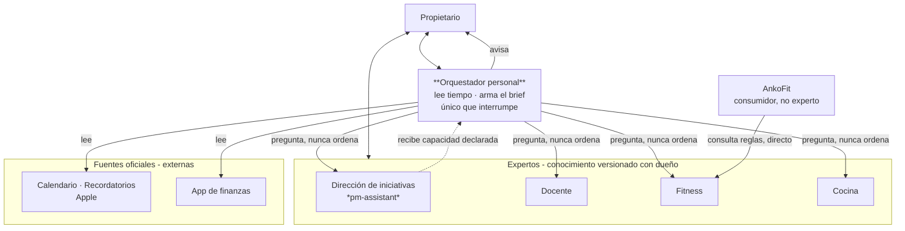

# ROUTER — contrato de fronteras del ecosistema

> **Fecha:** 2026-07-27 · **Estado:** vigente (D29, D30) · **Autoridad:** normativo para *quién posee qué*; no decide nada sobre el interior de ningún experto.
>
> **Esta es la copia canónica.** Vivió provisionalmente en `pm-assistant` hasta que este repo existió (2026-07-27); allá quedó solo una nota de alcance sobre sí mismo. Describe un ecosistema del que `pm-assistant` es **una pieza**, no el todo.

---

## 1. Por qué existe

El ecosistema tiene un problema recurrente y con nombre: **cuando el único contenedor bien construido es `pm-assistant`, todo cae ahí** — conocimiento docente, plantillas de entrenamiento, ambiciones de leer calendarios. No porque el producto lo pida (su constitución lo prohíbe en P0, P1, P5 y P12), sino porque no había vecinos donde poner esas cosas.

Este documento declara los vecinos y sus límites. **Su valor está en las columnas "No posee".**

## 2. La regla de corte

Dos tests. Se aplican en orden y no admiten interpretación:

**Test 1 — ¿Es forma o es contenido?**
> ¿Esto sería verdad en **cualquier** dominio, o solo en éste?
> Universal ⇒ experto en dirección. Específico del dominio ⇒ experto de dominio.

**Test 2 — el que ya existía** (`pm-assistant/02-product/scope-and-non-goals.md` §Reglas):
> ¿Esto **razona sobre la iniciativa** o **administra registros**? Administrar registros es sospechoso por default.

Casos resueltos, para que no se vuelvan a discutir:

| Caso | Dueño |
|---|---|
| El semestre va de abril a julio; el parcial es fecha dura | Dirección |
| Necesito 3 semanas de material listo por delante (colchón) | Dirección |
| Perdí una semana: qué recorto, qué se cae, qué se desplaza | Dirección |
| Qué se enseña en la semana 7 y qué prerrequisito tiene | Docente |
| Cómo se estructura un dictado de 3 h y qué errores anticipar | Docente |
| El mesociclo dura ~6 semanas y la 4ª es descarga | Dirección (la forma) sobre **plantilla del experto fitness** |
| Cuántas series efectivas, a qué RPE, qué progresión | Fitness |
| Qué receta hago con lo que tengo | Cocina |
| Gasté X este mes y se desvía de Y | Orquestador (**descriptivo**) |
| Deberías invertir en Z / tenés que comer esto | **Nadie.** P12 + no-objetivo permanente |

## 3. Mapa

## 4. Los expertos

Un experto es **conocimiento versionado con un dueño declarado y un contrato de qué afirma**. No es necesariamente un agente. Se vuelve agente solo cuando tiene que *actuar*, y hasta hoy ninguno tiene que.

### 4.1 Dirección de iniciativas — `pm-assistant` (este repo)

| | |
|---|---|
| **Dueño del conocimiento** | El propietario |
| **Estado** | [C] Existe. Código de Spec 001 completo, Spec 002 en premisas |
| **Posee** | Clasificar · formular · gobernanza proporcional · **plan** (ventana, bloques, unidades, orden, dependencias, peso, colchón) · **replanificar** · detectar (vencidos, zombis, fechas, colchón bajo umbral) · compromisos · decisiones · riesgos · cierre + retrospectiva · memoria de dirección |
| **No posee** | El **contenido** de ningún dominio · leer fuentes externas · **avisarte** · plantillas de dominio (mesociclo, temario, dieta) |

Es un **experto, no la capa transversal** (D30). No lee y no avisa: **detecta cuando le preguntan.**

### 4.2 Docente

| | |
|---|---|
| **Dueño del conocimiento** | El propietario |
| **Estado** | [C] **Ya tiene repo propio: `facundo-rubino/teaching-kb`** (privado). Es el experto declarado del ecosistema, no una pieza a crear |
| **Posee** | Temario y progresión pedagógica · estructura y timing de una clase · ejemplos · errores anticipados · evaluaciones · cobertura del obligatorio · gaps entre unidades |
| **No posee** | Fechas duras del semestre · colchón de material listo · qué se recorta al comprimir · el plan de la edición (todo eso es Dirección) |

**Revisión del 2026-07-27 (repo leído en commit `072c72c`):**

**Fuente de verdad — resuelta, y bien. [C]** `decisions/ADR-001-source-of-truth.md` fija Markdown+Git como fuente y Notion como interfaz visual; el README lo repite ("una única fuente de verdad para cada tipo de contenido"). Es **la misma respuesta que D22**, alcanzada por separado. No hay drift que arreglar en el repo.

> Residual localizado: la skill `~/.claude/skills/curso-global-manager` declara que "accede a **Notion** para detalles completos", tratando a Notion como fuente. Eso **contradice ADR-001**. La que está mal es la skill, no el repo. (Además nombra "Programación Frontend JS **2026**" mientras el repo diseña "Programación 1" — verificar si son el mismo curso o uno viejo. [?])

**Fuga en espejo — existe, y es grande. [C]** `teaching-kb` no es solo un KB: contiene **una segunda implementación completa de la capa de dirección**, construida por Codex en Goal mode:

| En `teaching-kb` | Equivalente en este repo |
|---|---|
| `GOAL.md`: resultado buscado · criterios de éxito · definición de terminado · restricciones · fuera de alcance | **Formulación / definición núcleo** (C2) |
| `project/ROADMAP.md`: hitos M0–M6 | Hitos y plan (C4) |
| `project/BACKLOG.md`: tareas con `TODO/DOING/BLOCKED/REVIEW/DONE` | Unidades de trabajo y estados (C4) |
| `project/status.json`: estado y progreso por hito | Tablero de portfolio (C11) |
| `status.json → human_approval_required` | **Compuerta de aprobación humana** (P6, C-aprobación) |
| `decisions/ADR-00X` | Registro de decisiones (C7) |
| `templates/COORDINATION_MEETING.md` | Módulo de reuniones (C8, D20) |
| `courses/*/RETROSPECTIVE_TEMPLATE.md` | Cierre y retrospectiva (C9) |

**Lectura correcta: esto es evidencia a favor de la arquitectura, no un incendio.** Dos construcciones independientes convergieron en la misma forma; eso confirma que "dirección" es una capa universal real y no una idea de este repo. Pero deja una decisión abierta: **dos sistemas de dirección o uno.**

**Postura [P]: migrar `GOAL.md` + `project/` a `direction-state` como iniciativa, dejando `teaching-kb` como KB puro (`docs/`, `courses/`, `decisions/`, `templates/`) — pero NO antes de que exista la Spec 002.** Migrar una iniciativa real a un sistema de planificación cuyo schema todavía no existe repetiría el error de H1 (D26): cargar trabajo real en algo sin validar. Hasta entonces, `teaching-kb` conserva su `project/` y Codex sigue andando.

**Mientras tanto, `teaching-kb` es el mejor insumo disponible para la Spec 002 — tercer caso real:**

- `courses/programacion-1/SCHEDULE.md` tiene las **15 unidades con orden y evidencia**, y le falta exactamente lo que la Spec 002 exige: peso en horas, marca tronco/opcional y dependencias (requisitos 1 y 2 de `pm-assistant/ROADMAP.md` §H2).
- Su sección "Criterio de ajuste" pide revisar el calendario cuando se confirmen "horas semanales, duración real del semestre, calendario de parciales". Eso es **la ventana y la capacidad de la Spec 002, escritas a mano y en prosa** — la validación más fuerte posible de las premisas de D27, hecha sin conocerlas.

**Las dos skills globales** (`curso-global-manager`, `dictado-docente-semanal`) son **consumidoras** del experto, no el experto. Su lugar es dentro de `teaching-kb`, versionadas con el conocimiento que leen; hoy pueden desincronizarse del repo sin que nadie se entere.

### 4.3 Fitness

| | |
|---|---|
| **Dueño del conocimiento** | **El entrenador/nutricionista** (delegación pendiente — es el motivo principal de este corte) |
| **Estado** | [P] No existe como pieza separada. Hoy vive dentro de AnkoFit |
| **Posee** | Plantillas de mesociclo (acumulación/intensificación/descarga) · progresión · cargas · RPE · series efectivas · criterios y contraindicaciones |
| **No posee** | Planificar la ventana ni el calendario (Dirección) · **mis datos de salud** (ver abajo) |

**Partición obligatoria del KB.** Sin esto la delegación es imposible:

| Subárbol | Contenido | Quién accede |
|---|---|---|
| `reglas/` | Plantillas, progresiones, criterios, contraindicaciones — genéricas | El entrenador lo posee y lo edita; AnkoFit lo consulta; es compartible |
| `datos/` | Mi peso, mis lesiones, mis marcas, mi historial | **Nunca sale.** Ni al entrenador por esta vía, ni a un modelo sin autorización explícita |

Restricción práctica registrada: **el entrenador no va a usar git.** El camino de edición tiene que ser uno que use de verdad (Notion o Markdown en Drive) con sincronización hacia el repo. Un KB que solo se edita por PR muere en la v1.

### 4.4 Cocina

| | |
|---|---|
| **Dueño del conocimiento** | El propietario |
| **Estado** | [C] Existe como asistente conectado a Cookidoo |
| **Posee** | Recetas · Cookidoo · restricciones y preferencias culinarias · qué se cocina con qué · **plan de comidas** · **lista de compras** |
| **No posee** | Nutrición prescriptiva (macros, déficit, timing) — eso es Fitness |

**El plan de comidas se queda acá, no va a Dirección.** Tiene forma de plan (ventana, bloques, unidades) y por Test 1 parecería universal, pero **P3 (proporcionalidad) manda**: una semana de cenas es una iniciativa trivial y no merece la maquinaria de dirección. Mandarla al experto en dirección sería recrear el desorden original con mejor vocabulario.

**Primer experto que va a necesitar *actuar*.** "Qué me falta comprar" es lectura, pero *"ya tengo leche, sacalo"* es una **escritura**. Por §8 regla 2, cocina sería el primero en graduar de KB a agente. Condiciones antes de hacerlo:

1. **Una sola lista canónica.** Cookidoo tiene lista de compras y Recordatorios también. Si viven las dos, hay drift — el problema que ADR-001 y D22 ya resolvieron dos veces. Recomendado: **Recordatorios es la lista** (es donde vas a mirar en el súper y está en el ecosistema); Cookidoo es de dónde salen los ingredientes.
2. **No inventariar la despensa.** Un inventario completo de lo que hay en casa es el proyecto que muere en dos semanas. La versión que sobrevive: la lista arranca de las recetas del día y solo registra lo que vos descartás.
3. **P6 se cumple solo, pero el borrado se confirma.** La aprobación humana *es* la frase que dijiste. Lo que no puede pasar es adivinar: "leche" contra "leche entera 1 L" es ambiguo, y el experto tiene que decir qué sacó, no sacarlo en silencio (P10).

### 4.5 Lo que **no** es un experto

| Pieza | Qué es | Regla |
|---|---|---|
| **AnkoFit** | Una **app consumidora**. Consulta al experto fitness; no lo contiene | Cuando el KB de fitness se separe, AnkoFit deja de ser dueño de las reglas y pasa a leerlas |
| **App de finanzas** | Una **fuente oficial**. Queda como está | El orquestador la lee y reporta. **Descriptivo siempre; prescriptivo nunca** (P12, prohibición absoluta) |

## 5. El orquestador personal

| | |
|---|---|
| **Estado** | [P] No existe. Es lo único genuinamente nuevo del ecosistema |
| **Posee** | Leer tiempo (calendario, recordatorios) · leer la app de finanzas · armar el brief · **ser el único que te interrumpe** · rutear lo que te involucra a vos |
| **No posee** | Conocimiento de ningún dominio · estado de ninguna iniciativa · decidir nada · ejecutar hacia afuera |

**Tres reglas duras:**

1. **Es el único con permiso de interrumpirte.** Si cada experto puede notificar, hay cinco fuentes de aviso y volviste a la fragmentación — el "antes" de `pm-assistant/02-product/product-vision.md`.
2. **Es el componente más restringido, no el más privilegiado.** Es lo único que ve calendario + finanzas + trabajo + salud a la vez, o sea el mayor punto de fuga posible del ecosistema. Sus límites están en D29 y no se relajan por conveniencia.
3. **No lleva constitución, ni specs, ni discovery.** Si necesita una spec, ya es demasiado grande. Un archivo de ruteo y unos disparadores.

## 5.bis Obsidian — superficie de edición, no fuente ni silo

Obsidian **no queda afuera**, pero su rol cambia respecto de lo que decía `integration-strategy.md`: deja de ser "una integración a construir" y pasa a ser **la ventana humana sobre los KB que ya existen**. No hace falta escribir código para eso.

Todos los expertos son Markdown en carpetas. Obsidian es un editor de Markdown sobre una carpeta. Apuntá un vault a `~/experts/` y sale gratis:

- edición desde el iPhone sobre el mismo archivo que versiona git;
- búsqueda y backlinks **entre expertos** (una regla de fitness citando una receta, una decisión docente citando una fecha del plan);
- vista de grafo del ecosistema, que es justo lo que ningún documento te da.

**La diferencia con Notion es la que importa, y es de fondo:**

| | Notion | Obsidian |
|---|---|---|
| Qué hace con el contenido | **Lo copia** a su propia base | **Abre el archivo** tal cual |
| Riesgo de drift | Real — necesitó `ADR-001` para resolverse | **Ninguno por construcción** |
| Rol correcto | Vista publicada, regenerable | **Editor** |

Notion necesitó una decisión de gobernanza porque crea una segunda versión. Obsidian no la necesita: no hay segunda versión que gobernar. Un conflicto de Obsidian es un archivo sin commitear, no una verdad paralela.

**Dónde Obsidian NO va:** el **estado de dirección** (`direction-state`) sigue fuera del vault, como fija DP3. Ese estado se valida contra `schemas/iniciativa.v1.json` y Obsidian te dejaría romperlo sin avisar. Editor de conocimiento sí; editor de estado validado no.

**Bonus para la delegación:** el entrenador no va a mandar un pull request, pero sí puede editar notas en una carpeta compartida. Obsidian sobre `fitness-kb/reglas/` es un camino de edición mucho más realista que GitHub, y deja el versionado del lado tuyo.

## 6. Reglas de comunicación

**El experto detecta; el orquestador avisa.** El motor determinístico de dirección computa vencidos, zombis y colchón (P9: una regla determinística no se muda ni se delega). Pero **responde cuando le preguntan; nunca empuja.**

**Consulta directa por default; orquestador solo donde te involucra a vos.**

| Situación | Camino |
|---|---|
| Una app pregunta reglas de su dominio (AnkoFit → Fitness) | **Directo.** Read-only, pull. Sin orquestador en el medio |
| Un experto necesita conocimiento de otro dominio | **Directo**, read-only |
| Hay conflicto entre dominios, tiempo o tu atención | **Orquestador** |
| Algo tiene que llegarte | **Orquestador**, siempre |

**Prohibido: comunicación push entre agentes.** Los expertos exponen conocimiento y responden; no se llaman entre sí por iniciativa propia. Ahí es donde la complejidad explota (loops, latencia, y la pregunta sin respuesta de quién decide cuando no coinciden).

**Lectura, partida por motivo:**

| Motivo | Quién | Ejemplo |
|---|---|---|
| Armar el plan | El orquestador lee y **le pasa** el dato al experto | "estas 6 semanas hay gimnasio martes y jueves" ⇒ Dirección planifica sobre esa capacidad |
| Avisarte | El orquestador, entero | el brief de la mañana |

El experto en dirección **nunca habla con EventKit**. Recibe capacidad declarada y planifica sobre ella — que es exactamente lo que la Spec 002 ya contrata en Q-S3, sin cambiarle una línea. Lo único que cambia con el tiempo es quién llena el campo: el propietario hoy, el orquestador después.

**Mecanismo:** MCP donde haga falta exponer un experto a un consumidor que no sea una conversación; archivos directos mientras el consumidor seas vos con un agente. Nunca protocolo propio (`pm-assistant/03-architecture/integration-strategy.md` §2). **Hoy MCP se justifica en exactamente un caso: AnkoFit → Fitness. No es urgente.**

## 7. Perímetros

Los perímetros del ecosistema son los de `pm-assistant/CONSTITUTION.md` P7 y no se aflojan por estar en una capa nueva. El límite del orquestador está en **D29**: metadatos de calendario corporativo sí (títulos, horarios, duración); cuerpos, adjuntos, invitados, contenido y estado corporativo de dirección, **no**.

Sin perímetro asignado ⇒ el más restrictivo. Falla cerrada.

## 8. Reglas de crecimiento (anti-overkill)

Escritas porque el modo de falla de este ecosistema está documentado: `pm-assistant` acumuló ~30 documentos de fundación antes de que H1 saliera **invalidado** al primer uso real (D26). El error no fue falta de rigor; fue **diseñar entero antes de usar nada**.

1. **No se declara un experto nuevo hasta que dos flujos reales lo pidan.** Doce expertos vacíos es el fracaso, no el objetivo.
2. **Un experto arranca como KB. Se vuelve agente solo cuando tiene que actuar.**
3. **Un solo estado por perímetro**, con subárbol por experto. D21 costó caro; no se resuelve cinco veces.
4. **Si el orquestador necesita una spec, es demasiado grande.**
5. **Una capa nueva que no le saca trabajo a lo que ya existe es una capa de más.** D30 le borró a `pm-assistant` los siete puertos y media H2.y; ese es el estándar.
6. **Un repo por experto, todos bajo una carpeta madre. No monorepo.** El dolor de "muchos repos tirados por ahí" es de *organización de archivos*, y se resuelve con `~/experts/{teaching-kb, fitness-kb, cooking-kb}` — un solo lugar donde mirar. Un monorepo lo resolvería igual pero **rompe la delegación**: los permisos de GitHub son por repo, no por directorio, así que darle acceso de escritura al entrenador sobre las reglas de fitness le daría acceso a todo lo demás (`CODEOWNERS` gobierna revisiones, no accesos). Como delegar el KB de fitness es la mejor razón de toda esta arquitectura, el monorepo se paga con lo único que más importa. Además `teaching-kb` ya existe con su `AGENTS.md`, su `package.json` y sus validaciones: fusionarlo es churn sin ganancia.

## 9. Estado real hoy (sin maquillaje)

| Pieza | Existe | Falta |
|---|---|---|
| Experto en dirección | [C] Sí, con código y tests | Spec 002 (planificación) |
| Experto docente | [C] **Sí: repo `teaching-kb`**, revisado. Skills adentro (`.claude/skills/`) y alineadas con ADR-001 | Conseguir los insumos faltantes (requisitos del obligatorio, dictado de ejemplo); decidir la migración de `GOAL.md`+`project/` **después** de la Spec 002 |
| Experto fitness | [P] No, vive dentro de AnkoFit | Separarlo, partirlo en `reglas/`+`datos/`, delegar `reglas/` |
| Experto cocina | [C] Sí, asistente Cookidoo | Elegir lista canónica; será el primero en necesitar escribir |
| Orquestador | [P] **No existe** | Todo. Primer flujo: brief diario (calendario + recordatorios) |

Lo más parecido a un orquestador que hay hoy es `~/.claude/skills/`, disponible desde cualquier proyecto, con `morning` ya haciendo un brief. **La capa existe a medias y sin contrato.** Este documento es el contrato; el brief diario es el primer uso.
